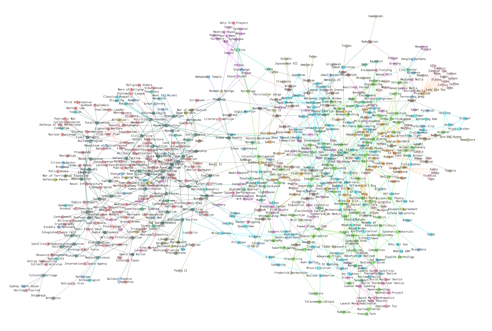

# civ6-graph

The [Civilization VI](https://civilization.com/) game is an awesome but complicated game. As a beginner of the Civ series, I approached learning the game in a slightly different way: by mapping out the entirety (or most of) the static dependencies of entities in the game. The resulting graph has 627 nodes (entities) and 1125 edges (connections). Node types include technologies, civics, building, resources, units, improvements, etc., and edge types include unlocks, boosts (for technologies and civics), upgrades (for units), replaces (for unique units or infrastructure of a specific civilization), etc.

You can also interact with portion of the graph via either the [Dash app](http://lkchemposer.pythonanywhere.com/) or the [demo notebook](https://mybinder.org/v2/gh/LKchemposer/civ6-graph/32fdcd2c5a0be17af49faa3d83c971d6472f257e?filepath=src%2Fdemo.ipynb) in this repo. If you're interested in the data itself, check out the [csv files](./data/csv/). I also added a [graphml file](./data/graph/) for any interested graph peeps.

## Data

The dataset was scraped from the [Civilization wiki page](https://civilization.fandom.com/wiki/Civilization_Games_Wiki), but only includes entities in the Vanilla pack (i.e., excluding Gathering Storm and Rise and Fall expansion packs), because I only have the Vanilla pack for the game.

* [scraping.py](./src/scraping.py): scraping from wiki pages using [beautiful soup](https://www.crummy.com/software/BeautifulSoup/bs4/doc/)
* [network_creation.ipynb](./src/network_creation.ipynb): creating graph from csv files using [networkx](https://networkx.org/) and pandas
* [demo.ipynb](./src/demo.ipynb): demo front end, imported from civ_widgets.py
* [civ_widgets.py](./src/civ_widgets.py): graph drawing code and widgets

## Requirements

I used [networkx](https://networkx.org/) as the graph backend, [igraph](https://igraph.org/python/) for layout (their implementation of the kamada kawai layout is much more visually appealing than networkx's), and [plotly](https://plotly.com/) for interactive visualization. [Ipywidgets](https://ipywidgets.readthedocs.io/en/stable/) is also needed to create in-notebook widgets. Versions are in [requirements.txt](./requirements.txt).

## Acknowledgements

* The [Civilization VI wiki page](https://civilization.fandom.com/wiki/Civilization_Games_Wiki), and the folks who contribute there.
* [pythonanywhere](https://www.pythonanywhere.com/) for hosting my Dash web app for free and for having neat documentation. Check out their services.

